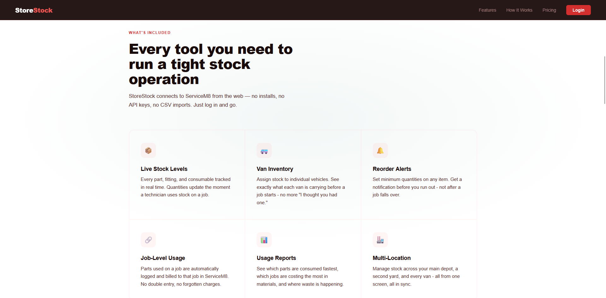
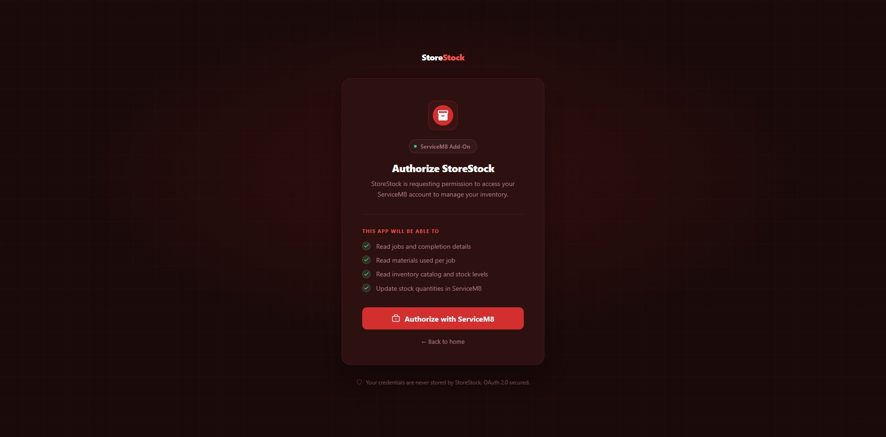
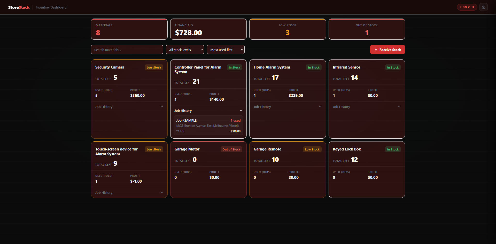

  

**StoreStock** is a web-based inventory dashboard that connects to your ServiceM8 account. 

It gives your team a single place to monitor stock levels, track material consumption across completed jobs, and update quantities when new deliveries arrive (without opening ServiceM8 directly).

---

## Table of Contents

- [Overview](#overview)
- [Before You Begin](#before-you-begin)
- [The Dashboard](#the-dashboard)
- [Receiving Stock](#receiving-stock)
- [Adjusting Stock](#adjusting-stock)
- [How Stock Figures Are Calculated](#how-stock-figures-are-calculated)
- [Screenshots](#screenshots)

---

## Overview
StoreStock connects directly to your [ServiceM8 account](https://www.servicem8.com/). 

Any changes made in StoreStock: receiving a delivery, correcting a quantity - are written back to ServiceM8 in real time. Likewise, when your team marks a job as completed in ServiceM8, the materials used on that job are automatically reflected in your stock figures.

There is no separate database to maintain. ServiceM8 remains the source of truth.

---

## Before You Begin
StoreStock **reads your materials** from ServiceM8, so your inventory needs to be set up there first.

1. In ServiceM8, go to **Inventory → Materials**
2. Create each product with a name, item number (optional but recommended), and unit price
3. Enable **Inventory Tracking** on each item
4. Set an initial quantity for each item

Once this is done, your materials will appear on the StoreStock dashboard automatically.

---

## The Dashboard

The dashboard is your at-a-glance view of current stock across all tracked materials. Each card shows:

- **Material name** and item number
- **Current quantity** on hand
- **Total used** across all completed jobs

From the dashboard, click the **Materials** card to open the full materials table, where you can view and edit individual stock levels.

---

## Receiving Stock

When a delivery arrives, use the **Receive Stock** flow to update your quantities.

1. Click **Receive Stock** in the navigation bar
2. Search for the material by name or item number
3. Enter the quantity received
4. Click **Confirm receipt**

StoreStock fetches the current quantity from ServiceM8, adds the amount you entered, and writes the updated total back. You do not need to know the current stock level beforehand — it is retrieved automatically.

---

## Adjusting Stock

Use stock adjustment when you need to correct a quantity directly — for example, after a stocktake reveals a discrepancy.

1. Click the **Materials** card on the dashboard
2. Click any row in the materials table
3. Enter the correct quantity
4. Click **Save**

Unlike receiving stock, this sets the quantity to exactly the value you enter. Use it for corrections, not for recording deliveries.

---

## How Stock Figures Are Calculated

StoreStock derives usage figures from your completed jobs in ServiceM8.

- Materials added to a job's line items are counted once the job is marked **Completed**
- Jobs that are still in progress are excluded from usage totals
- The current stock figure shown is whatever quantity is recorded against the material in ServiceM8 at the time of the page load

If a stock level looks unexpected, check that the relevant jobs are marked as completed in ServiceM8 and that Inventory Tracking is enabled on the material.

---

## Screenshots

---

*This web-based add-on was made by:*

 

